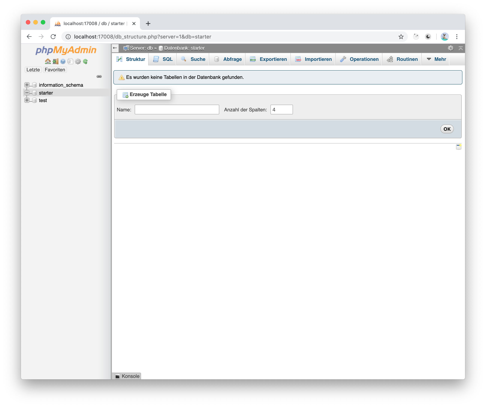
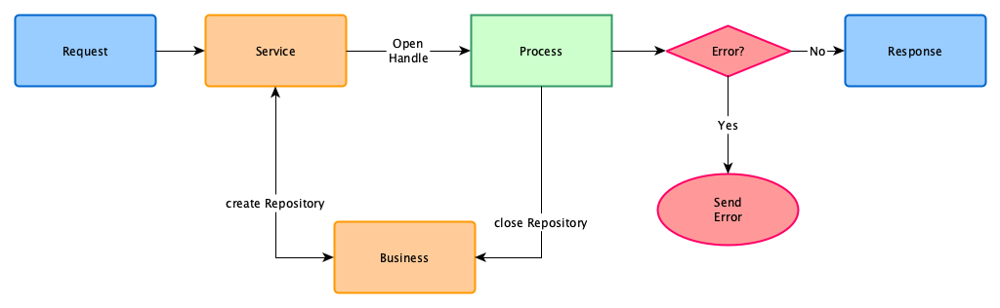

# NestJS Backend Starter

> A small nestjs backend with integration of mysql / sqlite


## Motivation

* Start with the important things faster, instead of spending time on the project setup first.
* The advantage of NestJS: It covers many technical aspects like database connection or validation.
* Some aspects are already integrated:
  * [OpenApi](OpenApiSpec) is set up
  * Connection to MySQL database is available. The database is executing in a docker container together with phpMyAdmin.
  * Use of SQL easily possible
  * The finished backend with NestJS can be executed in a docker container.
* Standards are using (MySql + phpMyAdmin) or Sqlite, Node, NestJs, Express, OpenApi, Docker, Docker Compose

## Quote from Nestjs

> Nest ([NestJS](NestJS)) is a framework for building efficient, scalable Node.js server-side applications. It uses
> progressive JavaScript, is built with and fully supports [TypeScript](Typescript) (yet still enables developers to
> code in pure JavaScript) and combines elements of OOP (Object Oriented Programming), FP (Functional Programming),
> and FRP (Functional Reactive Programming).
>
> *From* <https://docs.nestjs.com/>


## Requirements

Some programs must be available on the developer computer:

* Node <https://nodejs.org/en/> *use the LTS version*
* Yarn oder NPM (Yarn <https://classic.yarnpkg.com/lang/en/> *Yarn 2 isn't test*)
* Docker <https://www.docker.com/>
* Docker Compose
* Typescript <https://www.typescriptlang.org/><br>install global: `yarn global add typescript` or `npm i -g typescript`
* NestJS CLI <https://nestjs.com/><br>install global: `yarn global add @nestjs/cli` or `npm i -g @nestjs/cli`
* OpenSSL commando line interface for generate the local or develop cetrications (public and private keys)


## Setup


### Before Usage

* Setup the different ports for the backend server, the database server (MySql) and the phpMyAdmin instances.
* Search for the TODO and insert or replace value with your project specifications
* Build the docker images


### Testing

To execute the test cases, script `create-keys.sh` must first be executed to create a set of RSA keys.

Then the two files `test-private.pem` and `test-public.pem` are available, which are necessary for the test cases.

> **NOTE**: Please never commit the keys to the git repository.


### Database (MySql) in Docker

The Mysql / MariaDB database engine is running in docker container instance. There is also an instance of `phpMyAdmin` to edit the database data.

**Structure**

| Name                       | Description
|----------------------------|------------------------------------------
| `docker-compose.yml`       | The docker compose for the mysql database- and phpMyAdmin image.<br>It is depend on the file `docker-compose.env`.
| `docker.compose.env`       | The environment variables for the mysql server.
| `docker/db`                | The docker directory with the mysql configuration
| `docker/db/Dockerfile`     | The MySQL Docker file.
| `docker/db/sql`            | The directory for sql statement files for initialization of the database.

**Preview of phpMyAdmin**




## Configuration

This section describes the application configuration and commitments. The node application is configured over environment variables.

The application is managed via  **PM2** <https://pm2.keymetrics.io/docs/usage/pm2-doc-single-page/>


### Environment

> Some environment variable are not in the PM2 configuration, because they are secret and define global in the user profile file.

| Name                | Default        | Required | PM2 | Description
|---------------------|----------------|:--------:|:---:|--------------------------------------------------------
| **PORT**            | -              | Yes      | Yes | The port of the server being listen for request
| **HOST**            | `localhost`    | No       | Yes | The host name of the server
| **APP_HOME**        | -              | No       | No  | The application home directory. From the `HOME` directory are several sub directory with files.
| **DB_TYPE**         | -              | Yes      | Yes | Which type of database is configure:<br>**mysql**: The configuration is for MySQL database<br>**sqlite**: The database is for Sqlite database.
| **MySQL Server**    |                |          |     |
| **DB_PORT**         | `3306`         | No       | Yes | The port of the database service
| **DB_HOST**         | `localhost`    | No       | Yes | The host name of the database server
| **DB_USER**         | -              | Yes      | Yes | The database user
| **DB_DATABASE**     | -              | Yes      | Yes | The name of the database
| **DB_PASSWORD**     | -              | Yes      | No  | The password of the database user.<br>**REMARK** The environment is setting outside of the PM2 configuration. It is setting on the **User** `.profile` file
| **Sqlite Server**   |                |          |     |
| **DB_FILE**         | -              | Yes      | Yes | The filename of the sqlite database
| **AUTH_PRI_FILE**   | -              | Yes      | Yes | Environment variable for the filename of the private key
| **AUTH_PUB_FILE**   | -              | Yes      | Yes | Environment variable for the filename of the public key
| **DIGEST_SECRET**   | -              | Yes      | Yes | Environment variable for the digest secret in order of hash the password of the user. It could be a very long line of text.<br>**REMARK** The environment is setting outside of the PM2 configuration. It is setting on the **User** `.profile` file


### Type of Database

The backend is able to work with [MySql](MySql) or [MariaDB](MariaDB) or [Sqlite](Sqlite).

* **MySql** or **MariaDB** are using the node module <https://github.com/mysqljs/mysql>
* **Sqlite** is using the node module <https://github.com/mapbox/node-sqlite3>

The environment variable `DB_TYPE` determines which database the backend works with. There are two possible values:

* `mysql` for MySql configuration
* `sqlite` for Sqlite configuration


### PM2 Configuration

[PM2](PM2) is configured via a javascript config file. The file name must end with `config.js`.


#### MySql Configuration

**An excerpt from the configuration (MySql)**

```js
/*!
 * Configuration file for the PM2
 */
const os = require('os');

// ...

const userHome = os.homedir();
const dbPassword = fromEnv('DB_PASSWORD').asString;
const digestSecret = fromEnv('DIGEST_SECRET').asString;

module.exports = {
  apps: [
    {
      name: 'appName',
      script: `${userHome}/path/to/installed/lib/main.js`,
      cwd: `${userHome}/path/to/installed`,
      watch: true,
      env: {
        'PORT': '17050',
        'HOST': '127.0.0.1',
        'DB_TYPE': 'mysql',    // use the mysql database
        'DB_PORT': '3306',
        'DB_HOST': 'localhost',
        'DB_USER': 'dbUser',
        'DB_DATABASE': 'databaseName',
        'DB_PASSWORD': dbPassword,
        'AUTH_PRI_FILE': `${userHome}/etc/app/private-key.pem`,
        'AUTH_PUB_FILE': `${userHome}/etc/app/puplic-key.pem`,
        'DIGEST_SECRET': digestSecret,
      },
      listen_timeout: 5000,
      kill_timeout: 2000,
      restart_delay: 4000,
      max_restarts: 5,
      wait_ready: true,
      source_map_support: true,
    }
  ]
};
```

The critical environment settings are not setting in the **PM2** configuration file. They are setting in the User `.profile` file.

**Example of .profile**

```text
export DB_PASSWORD=xxxx
export DIGEST_SECRET=Phantasie ist alles. Es ist die Vorschau auf die kommenden Ereignisse des Lebens (Einstein).
```


#### Sqlite Configuration

**An excerpt from the configuration (Sqlite)**

```js
/*!
 * Configuration file for the PM2
 */
const os = require('os');

// ...

const userHome = os.homedir();
const digestSecret = fromEnv('DIGEST_SECRET').asString;

module.exports = {
  apps: [
    {
      name: 'appName',
      script: `${userHome}/path/to/installed/lib/main.js`,
      cwd: `${userHome}/path/to/installed`,
      watch: true,
      env: {
        'PORT': '17050',
        'HOST': '127.0.0.1',
        'DB_TYPE': 'sqlite',      // use the Sqlite databse
        'DB_FILE': `${userHome}/var/app/database.db`,
        'AUTH_PRI_FILE': `${userHome}/etc/app/private-key.pem`,
        'AUTH_PUB_FILE': `${userHome}/etc/app/puplic-key.pem`,
        'DIGEST_SECRET': digestSecret,
      },
      listen_timeout: 5000,
      kill_timeout: 2000,
      restart_delay: 4000,
      max_restarts: 5,
      wait_ready: true,
      source_map_support: true,
    }
  ]
};
```


## Request and Response Cycle

> Here is described how the request and response cycle works


### Overview




### Description

* A Request receives the backend controller
* The controller forwards the request to the service
* The service use the repository service to open a repository pool and process the specified steps and returns the response
* The business service close the repository pool
* If no error has occurred the response will send to the client
* In case of an error the error body will send to the client.


## Authorization & Authentication

The protected endpoints require a logged in user. Here is a description of how a user logs on first, gets an
authorization token and uses it for a protected endpoint.

* Authenticated User
* Authorisations
* Authentication

### Authenticated User

An authenticated user is a record containing the ID and roles of the user and his device ID.

The roles are used to determine whether the user has the necessary rights to execute the endpoint. The Device Id is used to check the validity of the logon.

**Example of the auth user data**

```json
{
  "id": 4711,
  "roles": ["read", "write", "admin"]
}
```

### Authorisations

A user must log in with his email and password. If both are correct, the user id and the user's roles are together the Authenticated User.

This auth user is encrypted with a private key and can be decrypted with the public key in the authentication process.


#### Authentication

A logged in user is required in protected endpoints. The client must send this information in the HTTP header **x-backend-starter**.

In the middleware service, the authenticated user will extract from the header (*decrypted with the public key*) and checked
with the included device whether the user still known and valid with his device.

If the check fails, a Http Status Code UNAUTHENTICATED is always sent.


### Access to AuthUser

In the endpoint the decorator '@GetAuthUser' can be used.

**Example**

```ts
async getBookList(@GetAuthUser() authUser: AuthUser, @Param('themeId') themeId: number): Promise<Book[]> {}
```


## Licence

```text
MIT License

Copyright (c) 2020 BlueSkyFish

Permission is hereby granted, free of charge, to any person obtaining a copy
of this software and associated documentation files (the "Software"), to deal
in the Software without restriction, including without limitation the rights
to use, copy, modify, merge, publish, distribute, sublicense, and/or sell
copies of the Software, and to permit persons to whom the Software is
furnished to do so, subject to the following conditions:

The above copyright notice and this permission notice shall be included in all
copies or substantial portions of the Software.

THE SOFTWARE IS PROVIDED "AS IS", WITHOUT WARRANTY OF ANY KIND, EXPRESS OR
IMPLIED, INCLUDING BUT NOT LIMITED TO THE WARRANTIES OF MERCHANTABILITY,
FITNESS FOR A PARTICULAR PURPOSE AND NONINFRINGEMENT. IN NO EVENT SHALL THE
AUTHORS OR COPYRIGHT HOLDERS BE LIABLE FOR ANY CLAIM, DAMAGES OR OTHER
LIABILITY, WHETHER IN AN ACTION OF CONTRACT, TORT OR OTHERWISE, ARISING FROM,
OUT OF OR IN CONNECTION WITH THE SOFTWARE OR THE USE OR OTHER DEALINGS IN THE
SOFTWARE.
```


[NestJS]:https://nestjs.com/
[Typescript]:https://www.typescriptlang.org/
[OpenApiSpec]:https://www.openapis.org/
[PM2]:https://pm2.keymetrics.io/
[MySql]:https://www.mysql.com/
[MariaDB]:https://mariadb.org/
[Sqlite]:https://www.sqlite.org/index.html
